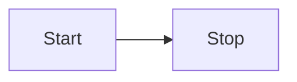

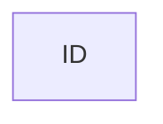


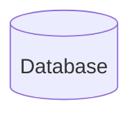

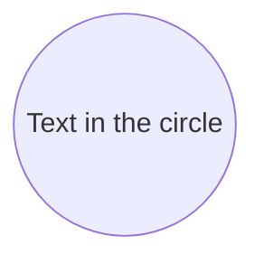

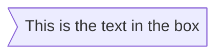

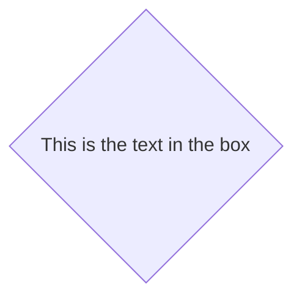


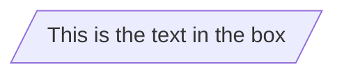

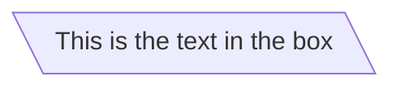

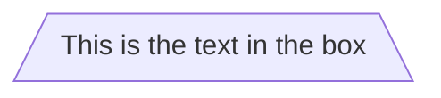

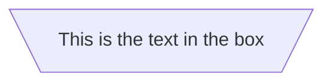

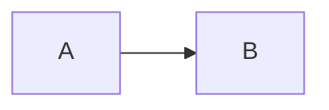

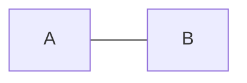

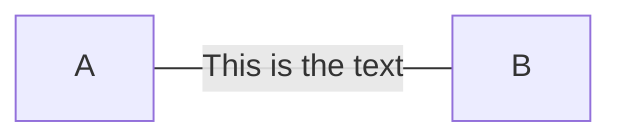


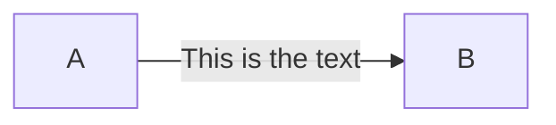


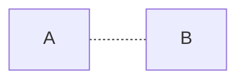

```mermaid
graph LR
    A -.This is the text.- B
```

```mermaid
graph LR
    A -.This is the text.-> B
```

```mermaid
graph LR
    A ==> B
```

```mermaid
graph LR
    A == text ==> B
```

```mermaid
graph LR
    A -- text --> B -- text2 --> C
```

```mermaid
graph LR
    A --> B & C --> D
```

```mermaid
graph TD
    A & B --> C & D
```

```mermaid
graph TD
    A --> C
    A --> D
    B --> C
    B --> D
```

```mermaid
flowchart TB
    c1-->a2
    subgraph one
    a1-->a2
    end
    subgraph two
    b1-->b2
    end
    subgraph three
    c1-->c2
    end
    one --> two
    three --> two
    two --> c2
```