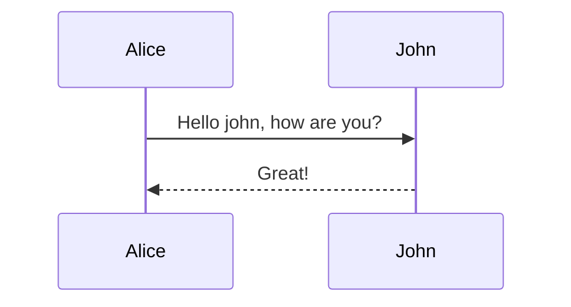
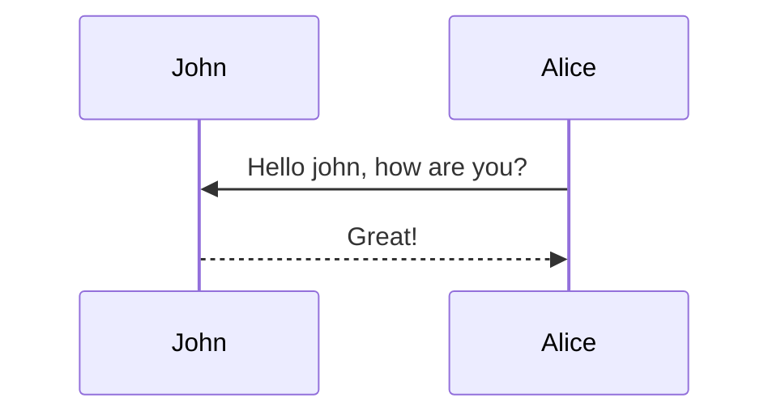
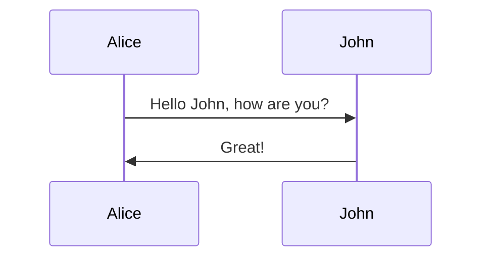
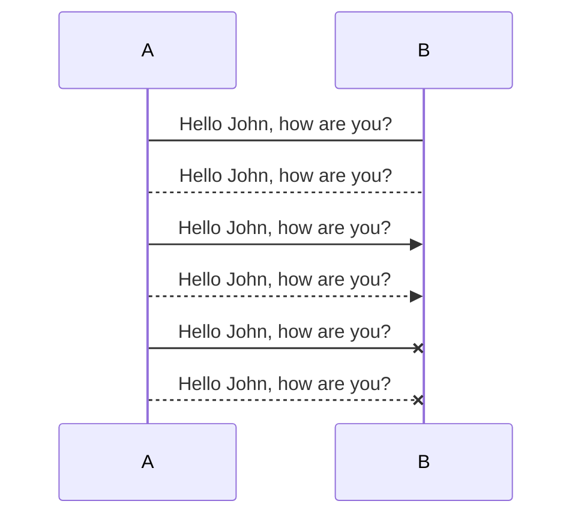
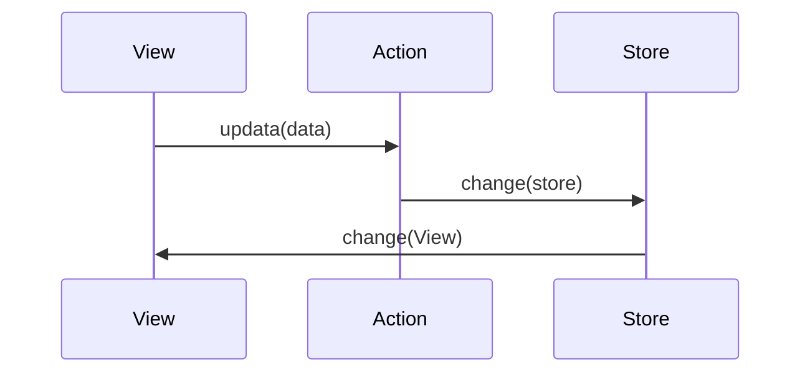
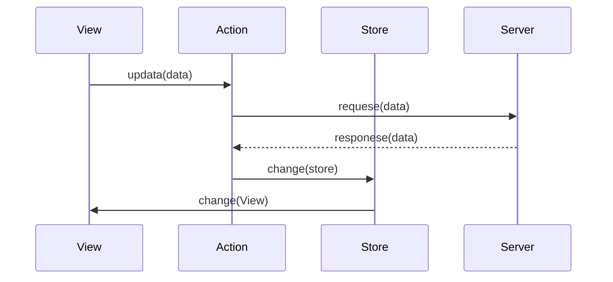
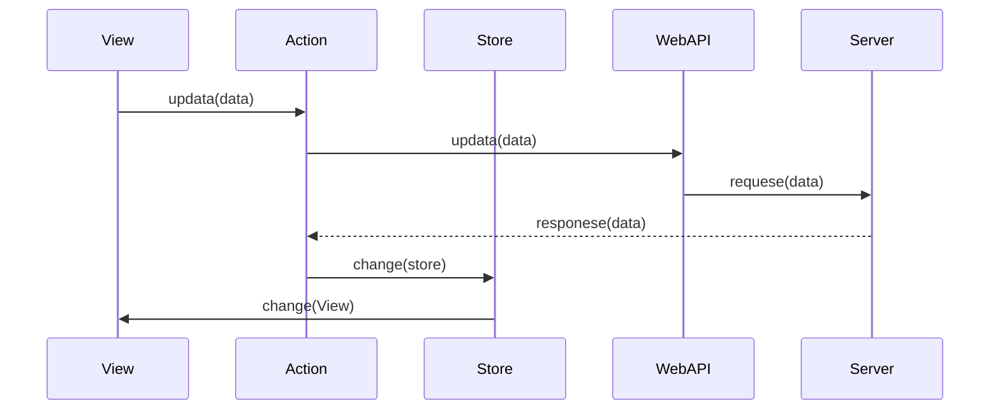

```mermaid
sequenceDiagram
    Alice->>John: Hello john, how are you?
    John-->>Alice: Great!
```

```mermaid
sequenceDiagram
    participant John
    participant Alice
    Alice->>John: Hello john, how are you?
    John-->>Alice: Great!
```

```mermaid
sequenceDiagram
    participant A as Alice
    participant J as John
    A->>J: Hello John, how are you?
    J->>A: Great!
```

```mermaid
sequenceDiagram
    A->B: Hello John, how are you?
    A-->B: Hello John, how are you?
    A->>B: Hello John, how are you?
    A-->>B: Hello John, how are you?
    A-xB: Hello John, how are you?
    A--xB: Hello John, how are you?
```

UI Action Store WebAPI Server

UI Server

```mermaid
sequenceDiagram
participant View
    participant Action
    participant Store
    View->>Action: updata(data)
    Action->>Store: change(store)
    Store->>View: change(View)
```

```mermaid
sequenceDiagram
    participant View
    participant Action
    participant Store
    participant Server
    View->>Action: updata(data)
    Action->>Server: requese(data)
    Server-->>Action: responese(data)
    Action->>Store: change(store)
    Store->>View: change(View)
```

```mermaid
sequenceDiagram
    participant View
    participant Action
    participant Store
    participant WebAPI
    participant Server
    View->>Action: updata(data)
    Action->>WebAPI: updata(data)
    WebAPI->>Server: requese(data)
    Server-->>Action: responese(data)
    Action->>Store: change(store)
    Store->>View: change(View)
```